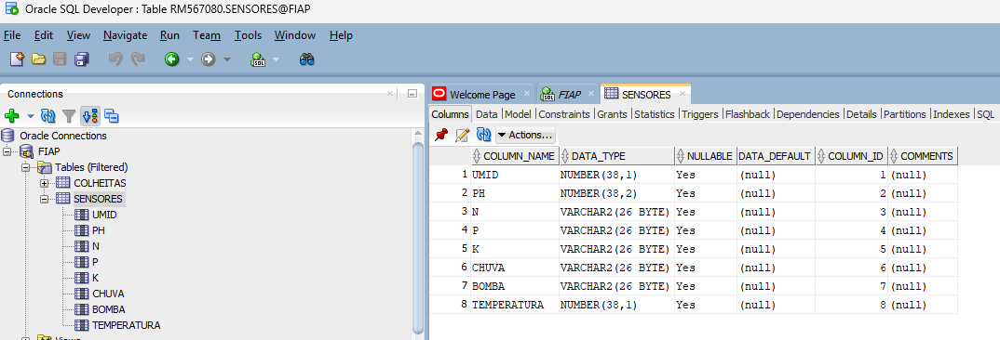
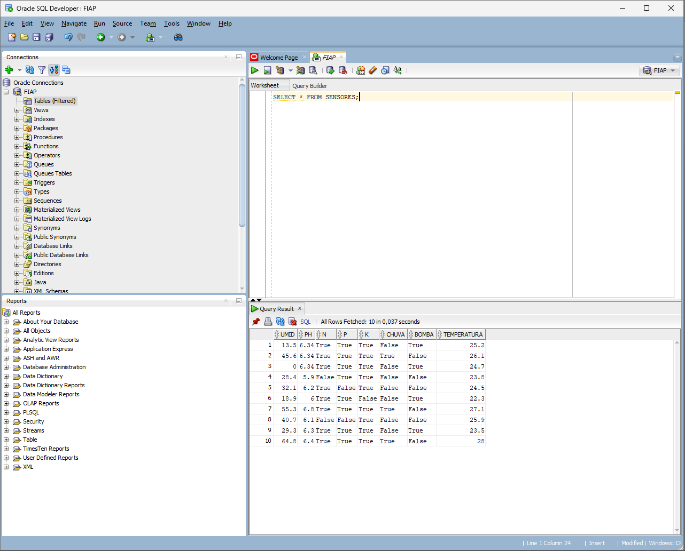

# 💾 Banco de Dados – FarmTech Agro

Este diretório contém os arquivos e evidências da importação dos dados de sensores da Fase 2.

## 📂 Estrutura
- **create_table_sensores.sql** → criação da tabela `SENSORES`
- **consultas.sql** → consultas de verificação no Oracle
- **Sensores_Fazenda.csv** → base de dados gerada na simulação Wokwi
- **prints/** → evidências de execução no Oracle SQL Developer

## 🧱 Estrutura da Tabela
Campos utilizados:
| Coluna | Tipo | Descrição |
|---------|------|------------|
| UMID | NUMBER | Umidade do solo |
| PH | NUMBER | pH simulado |
| N, P, K | VARCHAR2 | Nutrientes do solo |
| CHUVA | VARCHAR2 | Indicador de chuva |
| BOMBA | VARCHAR2 | Status da irrigação |
| TEMPERATURA | NUMBER | Temperatura ambiente |

## 🖼️ Prints



## 🧩 Consultas utilizadas
```sql
SELECT * FROM SENSORES;
